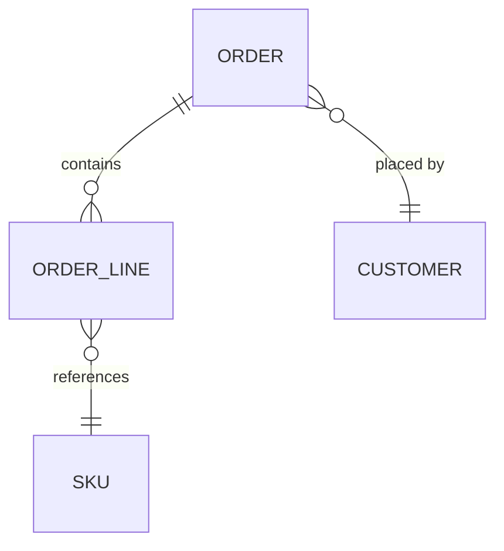

# Mapping a database schema

A schema is the one part of a system where a mistake outlives every refactor:
code gets rewritten, data gets migrated. This produces the map, and names what
looks wrong — it never changes a model.

Read the **migrations and the models**, in that order. Migrations are what the
database actually holds; models are what the application believes. Where the
two disagree, that disagreement is the first finding.

## 1. Generate `docs/data-model/erd.md`

A Mermaid `erDiagram`, derived from the models — never drawn from memory.

````markdown
# Entity relationships

<!-- Generated by the data-model-map skill. Regenerate after any migration. -->


````

Cardinality comes from the constraints, not from the relationship's name. A
column that is nullable is optional in the diagram, whatever the model says.

## 2. Write `docs/data-model/README.md`

One row per table. The generated diagram says what *is*; this says what it is
*for*.

| Table | Owned by | Means | Written by | Read by |
| ----- | -------- | ----- | ---------- | ------- |

Name the bounded context that owns each table. A table with two owners is a
finding, not a row.

## 3. Write `docs/data-model/invariants.md`

For each business rule that touches data: **where it is enforced** — a database
constraint, an application check, or nowhere — and what happens when it is
violated. This is `docs/coverage.md` applied to the schema.

A rule the database could hold as a constraint but does not is the interesting
line: it will be broken by the next import, script or console session, and the
document is where that gets decided rather than discovered.

## 4. Report the smells

Check the list in `.claude/rules/database.md` and report each candidate as:

- **What you see**, with table and column names.
- **Why it looks wrong** — the concrete consequence, not the principle.
- **What it would become**, and what that migration would cost.

Then stop. **Never change a model or write a migration on your own
initiative**: a schema change is a data migration, with a lock, a rollback and
a deployment order. Propose it; the developer decides.

If a candidate turns out to be deliberate, say so in
`docs/data-model/README.md` with the reason — so the next reader stops
re-discovering it.

## 5. Reconcile

Say what changed since the last generation, and flag anything the previous map
claimed that the schema no longer supports. That gap is the most valuable line
in the report.
