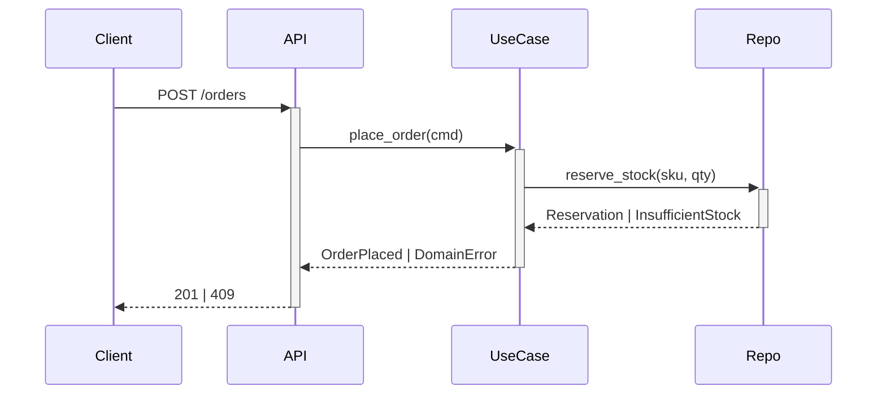

# Writing a flow document

A function is agnostic: it says what it does, never what problem it answers.
That lives in the chain of calls, which no docstring will ever describe — and
neither will it describe a **gap**. This document is where both go.

**Write it from the code, by reading it.** A flow written from intent, or from
the conversation that built the feature, describes the system you meant to
build. That document is worse than none, because it will be trusted during an
incident.

For a large or unfamiliar chain, dispatch the `flow-tracer` agent: tracing
reads many files to produce one small document, and that fan-out belongs in its
own context.

## Trace

Start at the entry point and follow the calls. Read every function you land in;
never infer a chain from names. Stop at the process boundary — a database call,
an HTTP call to another service, a queue publish — and name what is expected
across it.

## Write `docs/flows/<feature>.md`

````markdown
# <Feature>

**Trigger:** <route / command / job / event> — `module.symbol`

## Chain



| # | Call | Layer | Does |
| - | ---- | ----- | ---- |
| 1 | `api.orders.place` | presentation | validates the body, maps to a command |

## Business rules applied

| Rule | Enforced at | Symbol |
| ---- | ----------- | ------ |
| An order never exceeds available stock | step 3 | `domain.stock.reserve` |

## Failure behaviour

| Step | Failure | Raised | Caller sees | Rolled back |
| ---- | ------- | ------ | ----------- | ----------- |
| 3 | stock short | `InsufficientStock` | 409 + reason | reservation released |

## Boundaries

- Does **not** take payment — see `flows/checkout-payment.md`.
````

Every symbol is written so it can be grepped. A step you could not fully trace
is marked `<!-- unverified: why -->`, never quietly smoothed over.

Failure behaviour is the section people skip and then need at 3am. A step whose
failure mode is undocumented is the one that will page you.

## Reconcile `docs/coverage.md`

For each business rule in the flow: **how far it is actually enforced**, and
where enforcement stops. Add every scenario this flow does not handle, with its
reason — deliberate scope, known debt with its ticket, or blocked upstream.

Silence is the failure mode: a scenario absent from the file is
indistinguishable from a scenario nobody thought about.

## Report

Say what you wrote, which rules you mapped, which steps you could not verify,
and — most valuable — **any gap between what the code does and what
`coverage.md` claimed before you started**. Surface that; never fix it silently.
